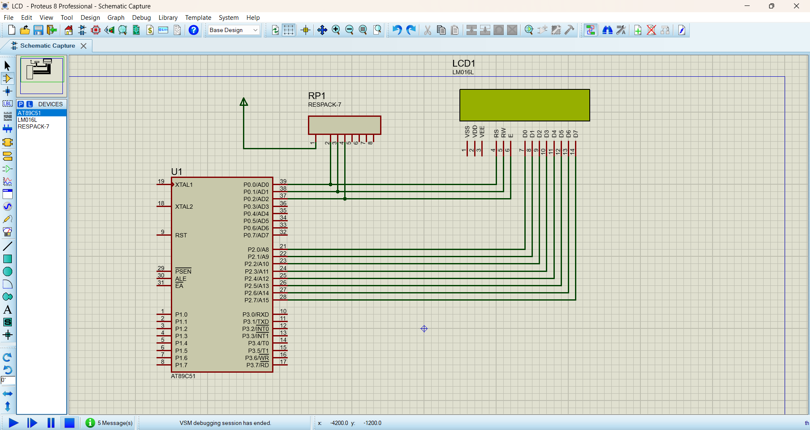
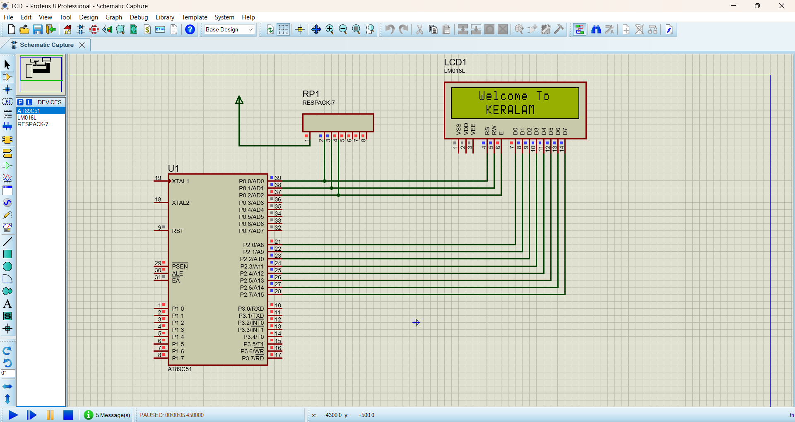

# 8051 LCD Display – Welcome Message

This project demonstrates **16×2 LCD interfacing with the 8051 microcontroller**. The LCD displays a welcome message using **8-bit data communication**.

## Project Overview

The **AT89C51/8051 microcontroller** is used to control a 16×2 LCD. The program initializes the LCD and displays:

```text
   Welcome To
    KERALAM
```

The message is displayed for a short duration, then the LCD is cleared and the process repeats continuously.

## Components Used

* AT89C51 / 8051 Microcontroller
* 16×2 LCD
* 10 kΩ Respack
* 5V External Power Supply

## Respack

A **10 kΩ Respack** is used as an external pull-up resistor network for **Port 0** of the 8051.

Port 0 requires external pull-up resistors because it does not have internal pull-up resistors.

## Software Used

* Keil µVision
* Proteus 8
* Embedded C
* 8051 Microcontroller

## Working Principle

1. The microcontroller initializes the LCD using LCD commands.
2. `cmd()` sends commands to the LCD.
3. `dat()` sends individual characters.
4. `show()` sends a complete string character by character.
5. The first line displays **"Welcome To"**.
6. The second line displays **"KERALAM"**.
7. After a delay, the LCD is cleared.
8. The same process repeats continuously.

## Important LCD Commands

| Command | Function                   |
| ------- | -------------------------- |
| `0x38`  | 8-bit mode, 2-line display |
| `0x0E`  | Display ON, cursor ON      |
| `0x01`  | Clear display              |
| `0x06`  | Increment cursor           |
| `0x0C`  | Display ON, cursor OFF     |
| `0x80`  | Move cursor to first line  |
| `0xC0`  | Move cursor to second line |

## Key Concepts

* 8051 Microcontroller
* LCD Interfacing
* GPIO
* 8-bit Data Communication
* LCD Commands
* Embedded C
* Delay Generation
* Port 0 Pull-up Respack
* Proteus Simulation

## Project Structure

```text
8051-LCD-Display/
│
├── LCD_Display.c
├── LCD_Display.hex
├── Proteus/
│   └── LCD_Display.pdsprj
└── README.md
```

## Output

```text
+----------------+
|  Welcome To    |
|   KERALAM      |
+----------------+
```
## Circuit Image


## Output Image 


## Learning Outcome

This project provides practical understanding of **LCD interfacing, 8051 GPIO control, LCD commands, string handling, Port 0 pull-up resistors, and Embedded C programming**.

## Author

**ABILASH S**

Embedded Systems | Embedded C | 8051 | PIC | ESP32


